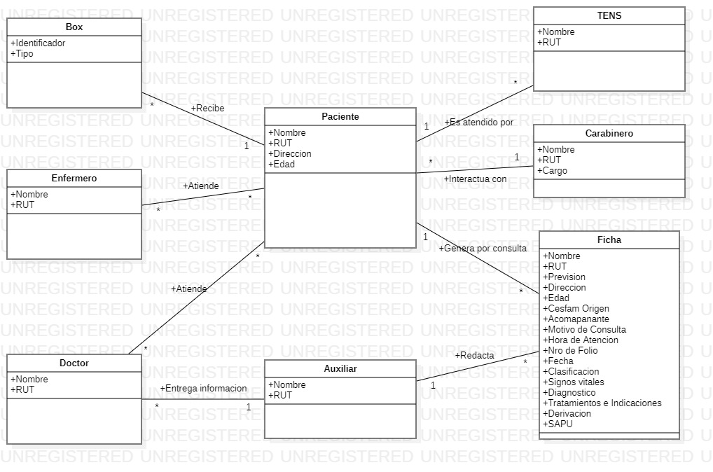

# Grupo 12
Este es el repositorio del Grupo 12, cuyos integrantes son:
* Jesus Escanilla - 202073570-0
* Miguel Soto - 201973623-K
* Vicente Alvear - 202073558-1

**Tutor: Cristian Tapia**

# Wiki
[Enlace a la Wiki](https://gitlab.inf.utfsm.cl/catapia/inf236-2023-1-par201-grupo-12/-/wikis/home)

## Base del proyecto
[Este proyecto esta basado en el Stack "M.E.R.N."](https://www.mongodb.com/languages/mern-stack-tutorial)

# Como ejecutar:

## Iniciar el Servidor (Backend):
```
cd mern/server
npm install
npm start
```

## Iniciar el Cliente (Frontend):
```
cd mern/client
npm install
npm start
```

# Objetivos y Criterios de Éxito
* Implementación de una plataforma virtual que permita atender a pacientes de un Servicio de Atención Primaria de Urgencia (SAPU) de forma expedita y eficiente.

* Creación de un módulo dentro de esta plataforma que permite la impresión de recetas médicas y fichas de atención en formato digital, para eliminar las problemáticas generadas por el calco y la ambigüedad de la letra manuscrita.

* El sistema resultante debe ser lo suficientemente intuitivo y ergonómico para que los costos/desafíos de la capacitación del personal del SAPU en este no ofusquen o eclipsen sus beneficios (CoDe)
# Actores Relevantes
* Paciente
* Ficha del Paciente
* Doctor
* Enfermero/a
* TENS
* Auxiliar
* Carabinero
* Box
* Diagrama de Contexto
* Modelo de Dominio

# Modelo de Dominio


### Cambios por hito:
1. Respecto al primer hito, decidimos modificar algunas entidades y asociaciones, principalmente, eliminamos la de equipo y modificamos la cardinalidad para un modelo mas general, en el caso de que la infraestructura de la clinica cambie y para permitir expandibilidad.

# Videos
Enlaces con los videos correspondientes
* [Video presentación avance 1](https://www.youtube.com/watch?v=Yh-PxxLBc8I&ab_channel=JesusEscanilla)
# Aspectos técnicos relevantes
Todo aspecto relevante cuando para poder usar el proyecto o consideraciones del proyecto base a ser entregado
